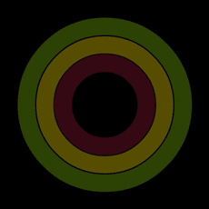
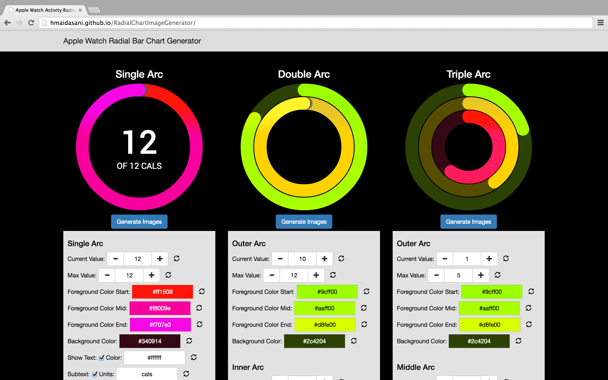
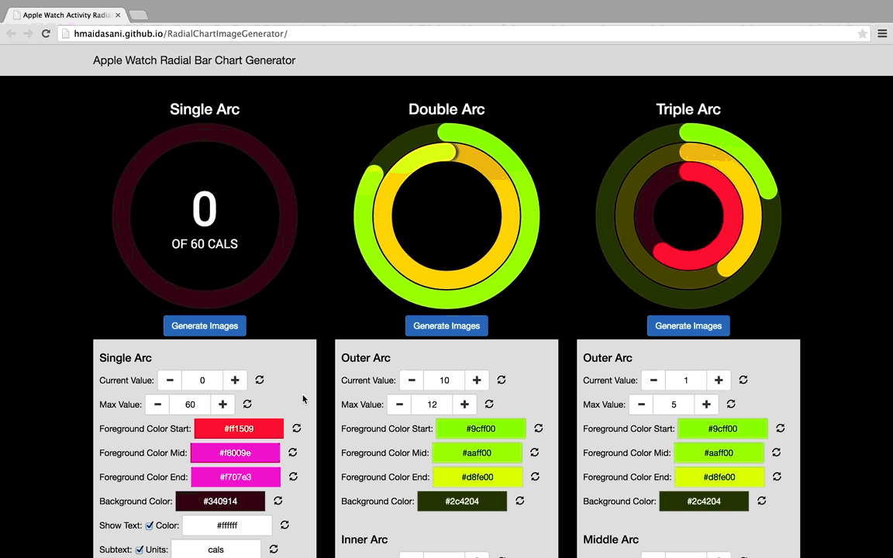
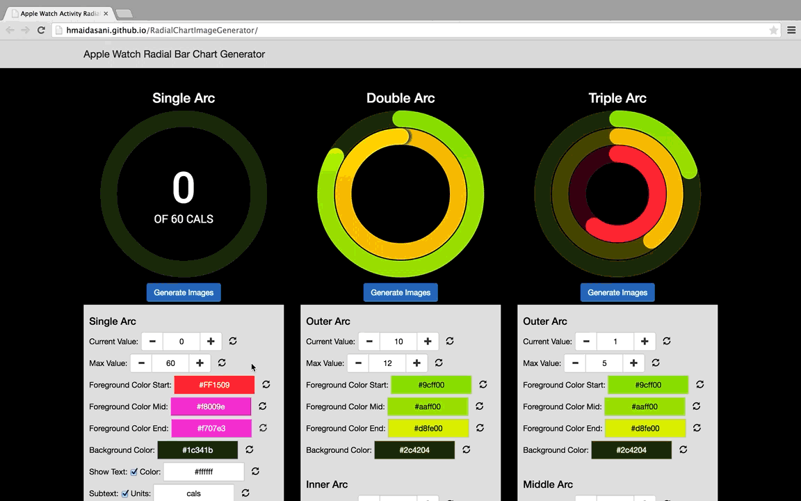
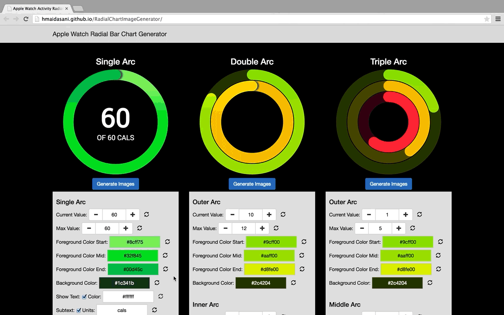
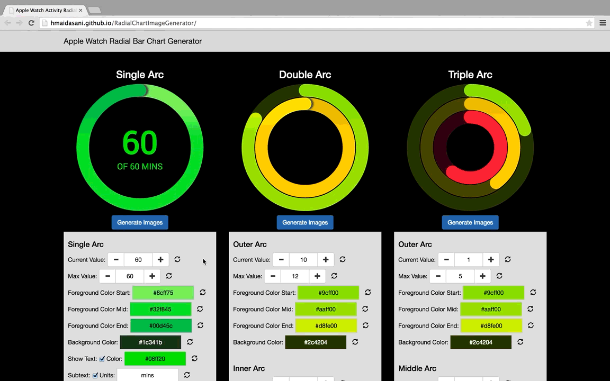

# RadialChartImageGenerator
A simple tool that generates images for animating radial or circular progress charts for the Apple Watch and WatchKit. The charts are referred to as rings, dials, radials or circles.

  

## Overview

#### Why care about radial progress charts?
* Clearly, Apple likes radial progress charts which are used in their activity monitor health watch app ([Apple Health & Fitness Watch App](https://www.apple.com/watch/health-and-fitness/)).

* Radial charts are just the right way to display a large amount of data on such a small screen size.

* We as humans have been trained to read radial progress charts from a very young age - clocks. That's why it makes a lot of sense to use them on a watch.

#### Why use the RadialChartImageGenerator?

* The Apple WatchKit SDK does not have a built-in tool or library to create these charts or any visualization.

* The way Apple WatchKit SDK allows animations or visualizations is to use a sequence of static images ([WatchKit Design Guidelines](https://developer.apple.com/library/prerelease/ios/documentation/UserExperience/Conceptual/WatchHumanInterfaceGuidelines/Animation.html#//apple_ref/doc/uid/TP40014992-CH7-SW1)). In fact, Apple's own WatchKit sample app called [Lister](https://developer.apple.com/library/prerelease/ios/samplecode/Lister/Introduction/Intro.html) does animations of this radial progress chart using 360 different static images of the chart. The reason for this is that drawing pixels or shapes would require a lot of computation and drain the battery of the watch.  So, good luck creating hundreds of images by yourself. 

* The RadialChartImageGenerator comes in to the rescue. With a few clicks, you can select whether you want a single, double, or triple arc radial chart (images shown above), customize the colors and text, and choose how many values or capacity the chart should have. The generator will finally generate every permutation of the radial progress chart and download a zip file with all the images. The alternative is to create these images manually in an image editor program like Photoshop, which would require a lot of effort and time. The RadialChartImageGenerator is a very simple tool that saves so much time with minimal effort. 

## How To Use

#### Instructions

1. Go to http://hmaidasani.github.io/RadialChartImageGenerator/ or open index.html (Chrome and Firefox recommended).

2. Decide on whether you need a single, double, or triple arc radial chart.

3. Choose the max value or the capacity of the appropriate arc.

4. Choose the arc background color.

5. Decide the color scheme for each appropriate arc. If you would like a gradient color scheme, choose three different colors for the foreground start, mid, and end colors. In order to see how this looks, choose the current value to be equal to the max value to see the full arc gradient. **Note: the current value has no effect on the output of the images - it is merely there to see how the arc would look at a given value.**

6. For the single arc, you may select if text should appear in the center. You may also select the text color and the units of the subtext.

7. Once you have modified each arc to your preference, click the Generate Images button to generate each permutation of images for the given arc structure. Enter the filename prefix of your choice and click on Continue. The double and triple arcs images can optionally be merged to have all the arc layers combined into a single image. The preferred method is to download the arc layers separately.

8. The images should download in a zip file.

9. Repeat for all the other arcs if needed.

10. Import the downloaded images into your WatchKit Xcode project. The below example projects show how this is done.

#### Examples

Here are some sample WatchKit apps using the images generated using the RadialChartImageGenerator. Note: the most recent version of Xcode is required to run these.

* Simple single arc app - [Radial - Single Arc.zip](https://github.com/hmaidasani/RadialChartImageGenerator/blob/master/examples/Radial%20-%20Single%20Arc.zip?raw=true)

* Simple triple arc app - [Radial - Triple Arc.zip](https://github.com/hmaidasani/RadialChartImageGenerator/blob/master/examples/Radial%20-%20Triple%20Arc.zip?raw=true)

* Health and Activity app - [Health.zip](https://github.com/hmaidasani/RadialChartImageGenerator/blob/master/examples/Health.zip?raw=true)

## Questions & Feature Requests

Report all of your questions and feature requests to the issues section of git repository.
